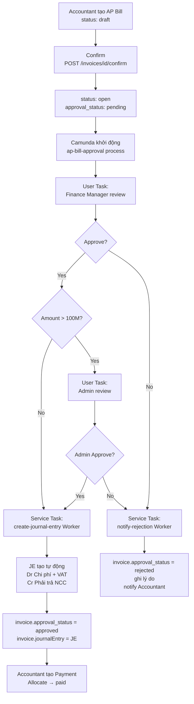

# Kế hoạch Tích hợp Camunda 8 — AP Bill Approval Workflow

## Tổng quan

Mục tiêu: xây dựng luồng duyệt AP Bill (hóa đơn mua vào) sử dụng Camunda 8 SaaS trong `efms-core-service`.  
Khi Accountant confirm một Invoice (type=`AP`), hệ thống tự động khởi động BPMN process `ap-bill-approval` trên Camunda. Finance Manager duyệt/từ chối qua User Task. Nếu approved, một Job Worker sẽ tự tạo Journal Entry (bút toán) và cập nhật trạng thái invoice.

---

## Kiến trúc tổng thể

```
Accountant                 efms-core-service                Camunda 8 SaaS (Cloud)
   │                               │                                  │
   │── POST /invoices/{id}/confirm ▶│                                  │
   │                               │── ZeebeClient.newCreateInstanceCmd
   │                               │        (ap-bill-approval)  ───▶  │
   │                               │                                  │── User Task: Review Bill
   │                               │                                  │     (Finance Manager)
   │                      Finance Manager approve/reject qua Tasklist UI hoặc API
   │                               │◀── Complete User Task ──────────  │
   │                               │                                  │── Gateway
   │                               │                                  │── Service Task: create-je
   │                               │◀── Job: create-journal-entry ───  │
   │                               │   (Job Worker tự xử lý)           │
   │                               │── Tạo JE, cập nhật invoice ──▶  DB
```

---

## Thay đổi cần thực hiện

### 1. Database — Thêm cột vào bảng `invoices`

#### [MODIFY] Migration SQL (Flyway hoặc chạy tay)

Cần thêm 3 cột vào bảng `invoices`:

```sql
ALTER TABLE public.invoices
    ADD COLUMN approval_status VARCHAR(20) DEFAULT NULL,       -- pending | approved | rejected
    ADD COLUMN approval_comment TEXT DEFAULT NULL,             -- lý do từ chối
    ADD COLUMN camunda_process_id VARCHAR(255) DEFAULT NULL;   -- lưu processInstanceKey từ Camunda
```

---

### 2. Entity — Cập nhật `Invoice.java`

#### [MODIFY] [Invoice.java](file:///d:/EFMS/efms-core-service/src/main/java/com/linhdv/efms_core_service/entity/Invoice.java)

Thêm 3 field mới tương ứng với 3 cột DB:

```java
@Size(max = 20)
@Column(name = "approval_status", length = 20)
private String approvalStatus;   // pending | approved | rejected

@Column(name = "approval_comment", length = Integer.MAX_VALUE)
private String approvalComment;

@Size(max = 255)
@Column(name = "camunda_process_id", length = 255)
private String camundaProcessId;
```

---

### 3. BPMN — Thiết kế Process `ap-bill-approval`

#### [NEW] `src/main/resources/bpmn/ap-bill-approval.bpmn`

Cấu trúc BPMN:

```
[Start Event: bill-submitted]
        │
        ▼
[User Task: finance-manager-review]
  - Assignee: Finance Manager (roleId hoặc userId)
  - Form fields: approve (bool), comment (string)
        │
        ▼
[Exclusive Gateway: approved?]
   ├── Yes ──▶ [Service Task: create-journal-entry]
   │             - Job type: "create-journal-entry"
   │                    │
   │                    ▼
   │           [End Event: bill-approved]
   │
   └── No  ──▶ [Service Task: notify-rejection]
                 - Job type: "notify-rejection"
                        │
                        ▼
               [End Event: bill-rejected]
```

**Variables đầu vào của process:**
| Variable | Type | Mô tả |
|----------|------|--------|
| `invoiceId` | String (UUID) | ID của AP Bill |
| `companyId` | String (UUID) | ID công ty |
| `partnerId` | String (UUID) | ID nhà cung cấp |
| `totalAmount` | Double | Tổng tiền |
| `submittedBy` | String (UUID) | Accountant |

**Variables từ User Task:**
| Variable | Type | Mô tả |
|----------|------|--------|
| `approved` | Boolean | true = duyệt, false = từ chối |
| `comment` | String | Ghi chú/lý do |

**Deploy BPMN lên Camunda SaaS:**  
Dùng Camunda Modeler (Desktop) → connect tới cluster `3a83fa33-8b6b-4996-a35d-f2f3600a87db` (region: `sin-1`) → Deploy.

---

### 4. Camunda Job Workers — `efms-core-service`

#### [NEW] `camunda/worker/CreateJournalEntryWorker.java`

**Job type:** `create-journal-entry`  
**Vai trò:** Tự động tạo Journal Entry khi Finance Manager approve.

```java
@JobWorker(type = "create-journal-entry")
public void handleCreateJournalEntry(final JobClient client, final ActivatedJob job) {
    // 1. Lấy variables từ Camunda
    UUID invoiceId = UUID.fromString((String) job.getVariablesAsMap().get("invoiceId"));

    // 2. Load invoice từ DB
    Invoice invoice = invoiceRepository.findById(invoiceId).orElseThrow();

    // 3. Tạo JournalEntry
    //    Dr: Chi phí (account từ invoice lines) + thuế VAT
    //    Cr: Phải trả NCC (account_payable)
    JournalEntry je = journalService.createApBillEntry(invoice);

    // 4. Liên kết JE vào invoice
    invoice.setJournalEntry(je);
    invoice.setApprovalStatus("approved");
    invoiceRepository.save(invoice);

    // 5. Complete job và trả variable
    client.newCompleteCommand(job.getKey())
          .variable("journalEntryId", je.getId().toString())
          .send().join();
}
```

#### [NEW] `camunda/worker/NotifyRejectionWorker.java`

**Job type:** `notify-rejection`  
**Vai trò:** Ghi lý do từ chối, cập nhật trạng thái invoice, gửi notification.

```java
@JobWorker(type = "notify-rejection")
public void handleNotifyRejection(final JobClient client, final ActivatedJob job) {
    Map<String, Object> vars = job.getVariablesAsMap();
    UUID invoiceId = UUID.fromString((String) vars.get("invoiceId"));
    String comment = (String) vars.getOrDefault("comment", "");

    Invoice invoice = invoiceRepository.findById(invoiceId).orElseThrow();
    invoice.setApprovalStatus("rejected");
    invoice.setApprovalComment(comment);
    invoiceRepository.save(invoice);

    // TODO: gửi notification tới Accountant (email / websocket)

    client.newCompleteCommand(job.getKey()).send().join();
}
```

---

### 5. Service — Tạo bút toán AP Bill tự động

#### [MODIFY] [JournalService.java](file:///d:/EFMS/efms-core-service/src/main/java/com/linhdv/efms_core_service/service/accounting/JournalService.java)

Thêm method `createApBillEntry(Invoice invoice)`:

```java
@Transactional
public JournalEntry createApBillEntry(Invoice invoice) {
    JournalEntry je = new JournalEntry();
    je.setCompanyId(invoice.getCompanyId());
    je.setEntryDate(invoice.getInvoiceDate());
    je.setReference(invoice.getInvoiceNumber());
    je.setDescription("AP Bill tự động - " + invoice.getInvoiceNumber());
    je.setStatus("posted");   // Auto-post khi approved
    je.setSource("ap_bill");
    je.setSourceRefId(invoice.getId());
    je.setCreatedAt(Instant.now());

    JournalEntry saved = journalEntryRepository.save(je);

    // -- Tạo dòng bút toán từ invoice lines --
    for (InvoiceLine line : invoice.getLines()) {
        // Dr: Chi phí (account của line)
        JournalLine expenseLine = new JournalLine();
        expenseLine.setJournalEntry(saved);
        expenseLine.setAccount(line.getAccount());
        expenseLine.setDebit(line.getAmount());
        expenseLine.setCredit(BigDecimal.ZERO);
        expenseLine.setDescription(line.getDescription());
        expenseLine.setCreatedAt(Instant.now());
        journalLineRepository.save(expenseLine);

        // Dr: Thuế VAT đầu vào (nếu taxAmount > 0)
        if (line.getTaxAmount().compareTo(BigDecimal.ZERO) > 0) {
            JournalLine taxLine = new JournalLine();
            taxLine.setJournalEntry(saved);
            taxLine.setAccount(vatInputAccount);  // account code 1331
            taxLine.setDebit(line.getTaxAmount());
            taxLine.setCredit(BigDecimal.ZERO);
            taxLine.setDescription("VAT - " + line.getDescription());
            taxLine.setCreatedAt(Instant.now());
            journalLineRepository.save(taxLine);
        }
    }

    // Cr: Phải trả NCC (account_payable - account code 331)
    JournalLine payableLine = new JournalLine();
    payableLine.setJournalEntry(saved);
    payableLine.setAccount(accountPayable);   // account code 331
    payableLine.setDebit(BigDecimal.ZERO);
    payableLine.setCredit(invoice.getTotalAmount());
    payableLine.setDescription("Phải trả NCC - " + invoice.getPartner().getName());
    payableLine.setCreatedAt(Instant.now());
    journalLineRepository.save(payableLine);

    return saved;
}
```

> [!IMPORTANT]
> Cần config 2 account cố định: **1331** (VAT đầu vào) và **331** (Phải trả NCC). Có thể lưu trong `application.yaml` hoặc tra từ bảng `accounts` theo `code`.

---

### 6. Service — Khởi động Camunda Process

#### [MODIFY] [InvoiceService.java](file:///d:/EFMS/efms-core-service/src/main/java/com/linhdv/efms_core_service/service/invoice/InvoiceService.java)

Inject `ZeebeClient` và gọi khi confirm:

```java
@Autowired
private ZeebeClient zeebeClient;

@Transactional
public InvoiceResponse confirm(UUID id) {
    Invoice invoice = findOrThrow(id);
    if (!"draft".equals(invoice.getStatus())) {
        throw new IllegalStateException("Hóa đơn phải ở trạng thái draft");
    }

    invoice.setStatus("open");

    // Chỉ khởi động approval workflow cho AP Bill
    if ("AP".equals(invoice.getInvoiceType())) {
        invoice.setApprovalStatus("pending");

        // Khởi động Camunda process
        ProcessInstanceResult result = zeebeClient
            .newCreateInstanceCommand()
            .bpmnProcessId("ap-bill-approval")
            .latestVersion()
            .variables(Map.of(
                "invoiceId",   invoice.getId().toString(),
                "companyId",   invoice.getCompanyId().toString(),
                "partnerId",   invoice.getPartner().getId().toString(),
                "totalAmount", invoice.getTotalAmount().doubleValue(),
                "submittedBy", invoice.getCreatedBy() != null
                                   ? invoice.getCreatedBy().toString() : ""
            ))
            .send().join();

        invoice.setCamundaProcessId(String.valueOf(result.getProcessInstanceKey()));
    }

    return toResponse(invoiceRepository.save(invoice));
}
```

---

### 7. API Endpoint — Finance Manager thao tác qua REST

#### [NEW] `controller/invoice/InvoiceApprovalController.java`

Cung cấp 2 endpoint để Finance Manager approve/reject (thay vì dùng Camunda Tasklist trực tiếp):

```
POST /api/invoices/{id}/approve
Body: { "comment": "OK" }

POST /api/invoices/{id}/reject
Body: { "comment": "Sai số tiền, cần sửa lại" }
```

**Cách hoạt động bên trong:**
1. Load invoice, lấy `camundaProcessId`
2. Tìm User Task đang active qua Zeebe API
3. Complete User Task với variable `approved = true/false`

```java
// Tìm và complete User Task
zeebeClient
    .newCompleteCommand(taskKey)  // lấy từ Operate API hoặc Tasklist API
    .variables(Map.of("approved", true, "comment", "OK"))
    .send().join();
```

> [!WARNING]
> **Vấn đề quan trọng:** Để complete User Task từ backend, bạn cần taskKey (không phải processInstanceKey). Có 2 lựa chọn:
>
> **Lựa chọn A (Đơn giản hơn):** Dùng **Camunda Tasklist REST API** để query task theo processInstanceKey, lấy taskId, rồi complete.  
> **Lựa chọn B (Phức tạp hơn):** Dùng Zeebe gRPC client trực tiếp — không còn hỗ trợ tốt trong SaaS mới.  
>
> **Khuyến nghị: Dùng Tasklist REST API (Lựa chọn A)**

---

### 8. Tích hợp Tasklist REST API

#### [NEW] `camunda/client/TasklistApiClient.java`

Sử dụng **Tasklist REST API** của Camunda SaaS:

- Base URL: `https://sin-1.tasklist.camunda.io/3a83fa33-8b6b-4996-a35d-f2f3600a87db`
- Authentication: OAuth2 client credentials (cùng `client-id`/`client-secret` trong config)

```java
// Lấy danh sách tasks theo processInstanceKey
GET /v1/tasks?processInstanceKey={key}&state=CREATED

// Complete một task
PATCH /v1/tasks/{taskId}/complete
Body: { "variables": [{"name": "approved", "value": "true"}, ...] }
```

Có thể dùng `WebClient` (Spring WebFlux) hoặc `RestTemplate` để gọi.

---

### 9. Cấu hình `application-dev.yaml`

Thêm config Tasklist API:

```yaml
camunda:
  client:
    mode: saas
    auth:
      client-id: jlgc24AXXn~8r54P2SM4~_ZwBn9mamVg
      client-secret: ...
    cloud:
      cluster-id: 3a83fa33-8b6b-4996-a35d-f2f3600a87db
      region: sin-1

efms:
  camunda:
    tasklist-url: https://sin-1.tasklist.camunda.io/3a83fa33-8b6b-4996-a35d-f2f3600a87db
    approval-threshold: 100000000  # 100 triệu VND — ngưỡng cần thêm cấp duyệt Admin
```

---

### 10. Ràng buộc bổ sung — Ngưỡng 100 triệu

> [!NOTE]
> Nếu `totalAmount > 100.000.000 VND`, BPMN cần thêm 1 tầng duyệt nữa (Admin).

**Cách thực hiện trong BPMN:**
```
[User Task: finance-manager-review]
        │
        ▼
[Gateway: approved?]
   ├── Yes ──▶ [Gateway: amount > threshold?]
   │               ├── Yes ──▶ [User Task: admin-review]
   │               └── No  ──▶ [Service Task: create-journal-entry]
   └── No  ──▶ [Service Task: notify-rejection]
```

Variable `totalAmount` đã được truyền vào process, gateway expression dùng FEEL:
```feel
= totalAmount > 100000000
```

---

## Sơ đồ luồng đầy đủ



---

## Thứ tự thực hiện

| # | Bước | File/Action | Ưu tiên |
|---|------|-------------|---------|
| 1 | Chạy migration SQL | Thêm 3 cột vào `invoices` | 🔴 Bắt buộc đầu tiên |
| 2 | Cập nhật `Invoice.java` | Thêm 3 field mới | 🔴 |
| 3 | Thiết kế BPMN | Camunda Modeler → deploy | 🔴 |
| 4 | Cập nhật `InvoiceService.confirm()` | Inject ZeebeClient, gọi process | 🔴 |
| 5 | Tạo `CreateJournalEntryWorker` | Job Worker xử lý bút toán | 🔴 |
| 6 | Tạo `NotifyRejectionWorker` | Job Worker xử lý từ chối | 🔴 |
| 7 | Thêm `createApBillEntry()` vào JournalService | Logic tạo JE tự động | 🔴 |
| 8 | Tạo `TasklistApiClient` | Gọi Tasklist REST API | 🟡 |
| 9 | Tạo `InvoiceApprovalController` | REST endpoint approve/reject | 🟡 |
| 10 | Thêm config ngưỡng 100M | `application.yaml` | 🟢 Optional |

---

## Câu hỏi mở cần xác nhận

> [!IMPORTANT]
> **Q1: Finance Manager thao tác ở đâu?**
> - **Option A:** Dùng Camunda Tasklist UI trực tiếp (không cần build thêm UI/API)
> - **Option B:** Xây REST API trong `efms-core-service`, FE gọi `POST /invoices/{id}/approve`
>
> **Khuyến nghị: Option B** — kiểm soát tốt hơn, dễ tích hợp với FE Next.js

> [!IMPORTANT]
> **Q2: Tài khoản kế toán cố định (1331, 331) được quản lý thế nào?**
> - Hardcode trong config (`efms.accounting.vat-account-code=1331`, `payable-account-code=331`)
> - Hoặc tra DB theo code khi cần
>
> **Khuyến nghị:** Tra DB theo code — linh hoạt cho nhiều công ty

> [!IMPORTANT]
> **Q3: Thông báo reject gửi qua kênh nào?**
> - Email (cần cấu hình SMTP)
> - WebSocket / SSE trong service
> - Chỉ cập nhật DB, FE polling
>
> **Cần xác nhận để thiết kế** `NotifyRejectionWorker` đầy đủ

---

## Verification Plan

### Automated
- Unit test `InvoiceService.confirm()` — kiểm tra gọi `ZeebeClient` đúng params
- Unit test `CreateJournalEntryWorker` — kiểm tra JE được tạo đúng bút toán cân đối

### Manual (sau khi deploy)
1. Tạo AP Bill → Confirm → kiểm tra Camunda Operate có instance mới
2. Complete User Task trên Camunda Tasklist → kiểm tra JE được tạo trong DB
3. Kiểm tra `invoice.approval_status = approved`
4. Tạo Payment → Allocate → kiểm tra `invoice.status = paid`
